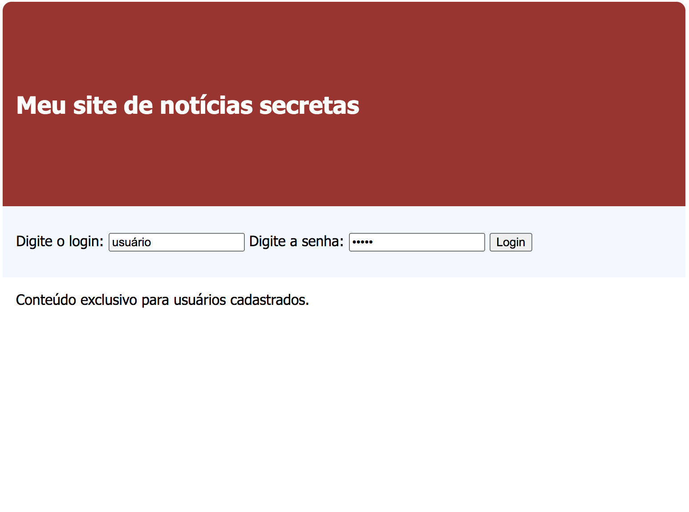
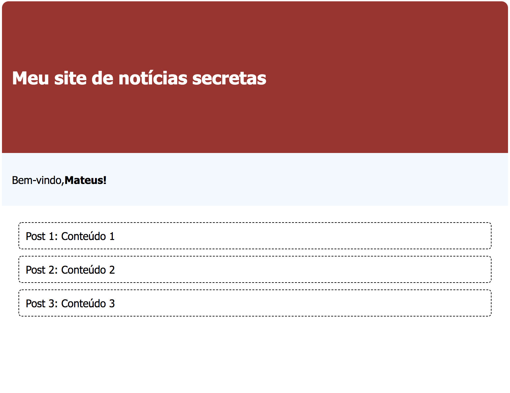

# aula-17-set-2020

Página com dinâmica com eventos em JS. A página contém uma seção de login e uma seção de conteúdo exclusivo para usuários cadastrados.

</img>

O login/senha digitado é verificado:
- se o usuário está cadastrado no sistema e
- se os dados de login/senha conferem,
então o usuário consegue visualizar a seguinte tela com sucesso:

</img>

# Importante: isso não é uma boa prática para projetos reais!

Essa implementação abstrai a comunicação com o **back-end**, por isso estamos tratando conceitos no front-end que deveriam ser feitos no back-end. Por exemplo: os dados de login/senha **devem ser validados no back**, pois não faz sentido o cliente ter acesso aos usuários e senha como nesse exemplo.

Dito isso, os dados com os usuários cadastrados e o conteúdo dos posts estão no arquivo **constantes.js**.

**FIXME**:
- evento para apagar o valor padrão das caixas de login/senha
- método de verificação de login
- método que exibe os posts (vindos do backend)

Tente fazer a implementação funcionar primeiro. A versão resolvida só deve ser consultada depois disso.

